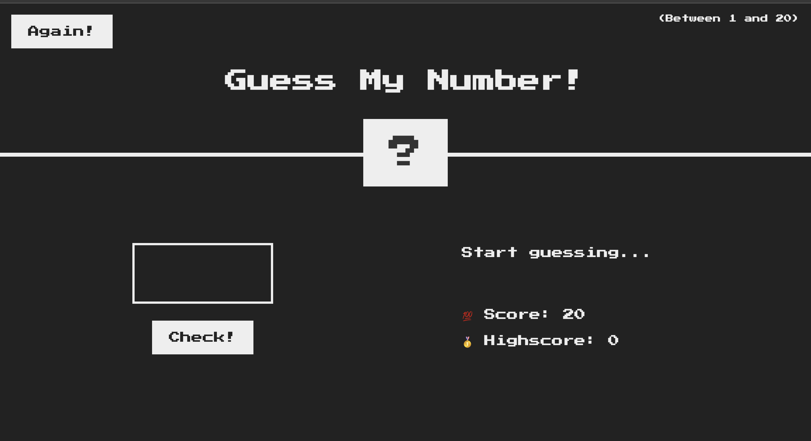

# Guess My Number! 🎉

Una divertida aplicación web para aprender JS en la que tendrás que **adivinar un número** entre **1 y 20**. ¡Pon a prueba tu intuición, mejora tu puntaje y desafía a tus amigos! 🤩

[](https://developer.mozilla.org/es/docs/Web/JavaScript)
[](https://developer.mozilla.org/es/docs/Web/HTML/HTML5)
[](https://developer.mozilla.org/es/docs/Web/CSS)

---

## 📚 Tabla de Contenidos

- [Descripción 📖](#descripción-)
- [Características 💡](#características-)
- [Demo 🎥](#demo-)
- [Instalación ⚙️](#instalación-)
- [Uso 🚀](#uso-)
- [Tecnologías 💻](#tecnologías-)
- [Contribución 🤝](#contribución-)
- [Licencia 📜](#licencia-)
- [Contacto 📞](#contacto-)

---

## Descripción 📖

"Guess My Number!" es un **juego interactivo** desarrollado con HTML, CSS y JavaScript que reta al usuario a adivinar un número secreto generado aleatoriamente entre **1 y 20**. Con efectos visuales llamativos, mensajes dinámicos y un estilo retro inspirado en los videojuegos clásicos, este juego es perfecto para pasar el rato y poner a prueba tu intuición. 🎮✨

---

## Características 💡

- **Interfaz Intuitiva:** Diseño limpio y moderno, con un toque retro gracias a la fuente "Press Start 2P". 🖥️
- **Retroalimentación Inmediata:** Mensajes y cambios de color que te indican si el número ingresado es muy alto o muy bajo. 🎯
- **Sistema de Puntaje:** Lleva el registro de tu puntaje actual y compite por el récord (highscore). 🏆
- **Reinicio Fácil:** Con solo presionar el botón **"Again!"** podrás reiniciar el juego y volver a intentarlo. 🔄

---

## Demo 🎥



_Disfruta del juego en acción y comprueba tu habilidad para adivinar el número secreto. ¡Es hora de divertirse! 🎉_

---

## Instalación ⚙️

Sigue estos sencillos pasos para ejecutar el juego en tu máquina local:

1. **Clona el repositorio:**

    ```bash
    git clone https://github.com/tu-usuario/guess-my-number.git
    ```

2. **Accede al directorio del proyecto:**

    ```bash
    cd guess-my-number
    ```

3. **Abre el archivo `index.html` en tu navegador:**

    - Haz doble clic sobre el archivo.
    - O, ejecuta en la terminal:
    
      ```bash
      open index.html
      ```
      *_(En Windows, haz doble clic o usa `start index.html` en la terminal)_*

---

## Uso 🚀

1. **Ingresa** un número entre **1 y 20** en el campo de entrada. 🔢
2. Presiona el botón **"Check!"** para comprobar si has adivinado el número secreto. ✔️
3. Observa el **mensaje** que te indica si tu número es demasiado alto o bajo. 💬
4. Si aciertas, ¡se mostrará el número correcto, cambiará el color de fondo y se actualizará tu puntaje! 🎉
5. Para reiniciar el juego y volver a intentarlo, haz clic en el botón **"Again!"**. 🔄

---

## Tecnologías 💻

Este proyecto fue construido utilizando:

- **HTML5** para la estructura del sitio. 🏗️
- **CSS3** para los estilos y la presentación visual. 🎨
- **JavaScript (ES6)** para la lógica del juego y la interactividad. ⚙️

---

## Contribución 🤝

¡Las contribuciones son siempre bienvenidas! Si deseas mejorar el juego o agregar nuevas funcionalidades, sigue estos pasos:

1. **Haz un fork** del repositorio. 🍴
2. **Crea una rama** para tu nueva característica:
    ```bash
    git checkout -b feature/nueva-caracteristica
    ```
3. Realiza tus cambios y **haz commit**:
    ```bash
    git commit -m "Agrega nueva característica"
    ```
4. **Envía un pull request** para que se revisen tus cambios. 🚀

---

## Licencia 📜

Este proyecto se distribuye bajo la licencia [MIT](LICENSE). 🔓

---

## Contacto 📞

Si tienes alguna pregunta, sugerencia o simplemente deseas saludar, puedes contactarme:

- **Nombre:** Javier González Giménez  
- **GitHub:** [gonzgimnzjavier](https://github.com/gonzgimnzjavier)  
- **Email:** [javiergonzalezgimenez2003@gmail.com](mailto:javiergonzalezgimenez2003@gmail.com)

---

¡Diviértete jugando y superando tu puntaje! 🚀😄
